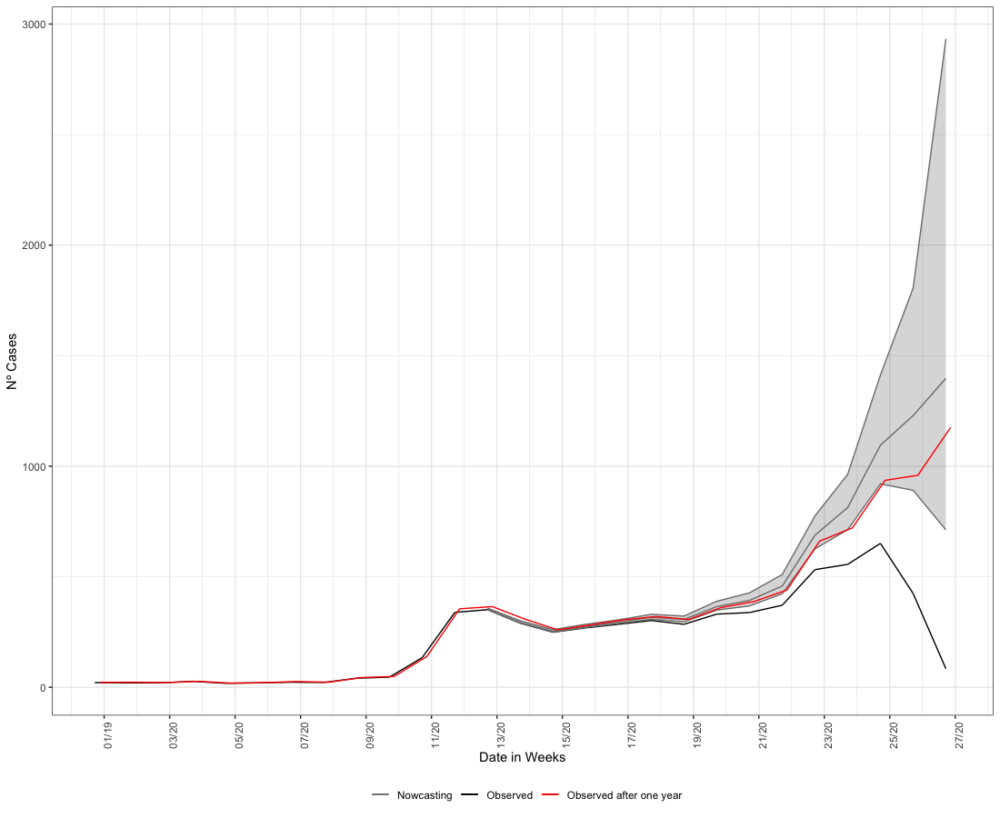

layout: true

```{r setup, include=FALSE}
options(htmltools.dir.version = FALSE)
knitr::opts_chunk$set(echo = FALSE)
```

```{r xaringan-themer, include = FALSE}
options(htmltools.dir.version = FALSE)
library(xaringanthemer)
library(xaringanExtra)
library(knitr)
library(DT)
library(RefManageR)
library(icons)
# duo_accent(
#   primary_color = "#A70000",
#   secondary_color = "#ff0000",
#   white_color = "white",
#   header_font_google = google_font("Roboto Condensed"),
#   text_font_google   = google_font("Roboto Condensed", "300", "300i"),
#   code_font_google   = google_font("Ubuntu Mono"), text_font_size = "30px")
# use_extra_styles(
#   hover_code_line = TRUE, 
#   mute_unhighlighted_code = TRUE)
xaringanthemer::style_mono_accent(
  base_color = "#A70000",
  #  primary_color = "#A70000",
  #secondary_color = "#ff0000",
  white_color = "white",
  colors = c(
    red = "#A70000",
    purple = "#88398a",
    orange = "#ff8811",
    green = "#136f63",
    blue = "#4B4FFF",
    white = "#FFFFFF",
    black = "#181818"
  ),
  header_font_google = google_font("Roboto Condensed"),
  text_font_google   = google_font("Roboto Condensed", "300", "300i"),
  code_font_google   = google_font("Ubuntu Mono"),
  text_font_size = "30px",
  code_font_size = "30px",
)
xaringanExtra::use_share_again()
```

---

class: left

## Find me at

.left-column[

`r fontawesome::fa("github")` GitHub: [https://github.com/rafalopespx/](https://github.com/rafalopespx/)

`r fontawesome::fa("mail-bulk")` e-Mail: [lopes1313@gmail.com](mailto:lopes1313@gmail.com)

`r fontawesome::fa("twitter")` Twitter: [@rafalpx](www.twitter.com/rafalpx)

]

.pull-right[


]

---

## About me

+ Ph.D. in Physics at the Instituto de Física Teórica - IFT/ UNESP-SP

+ With a exchange period (2021-2022), in the Barcelona Institute for Global Health (ISGlobal), at Barcelona.

+ Master in Physics by IFT/UNES-SP (2018)

+ Bachelor in Physics by UNICAMP (2014)

---

## Summary

This presentation is divided into 3 main parts:

+ Historical background on dengue in Brazil

+ Epidemiological analysis of dengue and temperature data

+ Nowcasting delays (Nowcaster R package)

---

class: middle, center, inverse

# Historical background

---

## Historical background

Dengue has been a major problem in Brazil throughout the 20th Century:

- First records of dengue in Brazil starts on the last decades of the 19th century

- The main vector of dengue, _Aedes Aegypti_ got locally eliminated, but was reintroduced in the 1970s

- Since then, dengue has continuously risen in incidence and dispersion over the Brazilian territory

- Since 2001, a dedicated system of notification and surveillance to the disease was built

---

## Dengue disease

.pull-left[

Dengue has the following characteristic:

  - vector borne disease, human-mosquito-human cycle

  - incubation period of four- to six-day and persists until around the time fever abates, 
which is typically three to seven days, potential of cryptic transmissions

  - endemic disease in Brazil, with yearly cycles of outbreaks

]

.pull-right[

```{r}
knitr::include_graphics("img/Aedes_aegypti.jpg")
```

]

---

## Characteristics of dataset

The SINAN-Dengue has:

  - ~11.0 million of individual cases confirmed for dengue, with information of Sex, Age, Municipality of Residence, from 2001 to 2020

  - Sparse data before 2000, due to non obligatory notification, more consistent data after 2001

  - With the majority of cases in the Southeast region and Northeast regions, ~5.7 millions and ~2.2 million cases, respectively

---

## Characteristics of dengue epidemics

The time-series of cases shows:

  - Strong seasonality, right after the rainy season, relation to mosquito life cycle

  - endemicity, endemic of annual outbreaks  of four different serotypes

  - More recently, since 2020, has been a raising on incidence and spread to the South region

---

```{r endemicity, echo=FALSE, message=FALSE, warning=FALSE, out.width=750, fig.align='center'}
knitr::include_graphics("img/dengue_cases_regions_after_2001.png")
```

---

class: middle, center, inverse

# Epidemiological analysis

In collaboration with: Xavier Basagaña, Leonardo S. L. Bastos, Fernando A. Bozza, Otavio T. Ranzani

---

## Objectives and questions

**How ambient temperature affects the counts of hospitalization due to dengue, during the period of 2010-2019?**

Objectives: 

  - To quantify association of daily ambient temperature and counts of hospitalization due to dengue

---

## Data sources:

  - We used the Brazil national database of authorization for hospitalization (AIH), filtered for the ICD-10 codes, ’A90’, ’A91’, ’A97’, ’A970’, ’A971’, ’A972’, ’A979’, for the hospitalization cases of dengue, aggregated by municipality.

  - For the climate variables, we used the gridded daily temperature taken from reanalysis products (ERA5Land) which were aggregated as weighted mean areas over the municipality extent area, to create matching time series for each municipality.

---

## Study Design

We did a two-stages design, to the association of the daily mean temperature and counts of hospitalization due dengue.

  + First stage: A "Time Stratified" design for the aggregated level of a each of 27 states, with a stratum for each municipality within a state, day of the week and the month on the time series

  + Second stage: Multivariate Meta-analysis for the coefficients fitted and the Covariance matrix, in two levels of aggregation, for the whole country and for the 5 macro regions of Brazil

  - The model on this level was a multivariate random effects model ran by a restricted maximum likelihood estimator

---

## Model specification, first stage

We suppose the dengue hospitalization counts in a city $i$ at time $t$ is given by a $Poisson(\lambda_{i,t})$ distribution, with the conditional that $Y_{.,t} = \sum_i Y_{i,t}$, this can be rewritten as:

$$
\begin{equation}
Y_{i,t} \sim quasiPoisson(\lambda_{i,t},\psi)
\end{equation}
$$

Where the $\lambda_{i,t}$ is the mean of $quasiPoisson$ distribution and $\psi$ is the parameter to control overdispersion, and we choose a log function for the link-function

---

## Model specification, first stage

On each of 27 states, we run a Conditional Poisson model, for the association between dengue hospitalizations time series and mean temperature for each municipality:

$$log[\lambda_{i,t}] = \xi_{t,i} + f(x_{t,i},l) + \sum_{k=1}^{K}s_k(t)$$

Where $\lambda_{t,i}$ is as before the mean of count of cases at $t$ on the i-th municipality, $\xi_{t,i}$ the dow-month-city strata term conditioned out. $f(x_{t,i}, l)$ which is the __DLNM__ for mean temperature on the state by each day of delay, until 21 days of lags. The last term is the long-term trend for temperature trend along the whole period, a natural spline with 7 degrees of freedom by year on the whole period.

---

## Second Stage

For the second stage we choose a multivariate meta-analysis model, on each meta-analysis level, whole country or by macro region, with the following formulation:

$$
\begin{equation}
\hat{\theta_i} | u_i \sim N_k (\theta + u_i , S_i ), \\
u_i ∼ N_k (0, \psi)
\end{equation}
$$

Where $\hat{\theta_i}$ is a vector of $k\times1$ combined effects to the estimate, $u_i$ is a vector of $k \times 1$ random effects for the coefficients of study $i$. $S_i$ matrix $k \times k$ covariance matrix within studies for the study $i$ and $\psi$ matrix $k \times k$ covariance between studies, defined by $k(k + 1)/2$ variables $\xi$.

---

class: middle, center

# Second Stage Results, Whole Country Meta-analysis

---

```{r brasil-overal-absolute, echo=FALSE, message=FALSE, warning=FALSE, out.width=800, fig.align='center'}
knitr::include_graphics("img/figure_1_meta_analysis.png")
```

---

class: middle, center

# Second Stage Results, Regions Meta-analysis

---

```{r regions-overall-absolute, echo=FALSE, message=FALSE, warning=FALSE, out.width=800, fig.align='center'}
knitr::include_graphics("img/plot_overall_regions_all_regions_gnm_meta.png")
```

---

## Conclusion & Interpretation

  * The main finding is that there is a higher risk of being hospitalised by dengue as the temperature gets higher.
  
  * At the 50th percentile of temperature, the RR for dengue hospitalization is 1.4x higher than at MHT, at 95th it is 1.5x higher than at MHT
  
  * We found a stronger immediate effect on the RR to the hospitalisation, with a slight lagged effect
  
  * We found the same patterns over each macro region of Brazil for the general association between RR hospitalisation and ambient temperature. 

---

class: middle, center, inverse

.pull-left[

# Nowcaster R package

In collaboration with: Leonardo Bastos, (FioCruz)

]

.pull-right[

# <a href='https://covid19br.github.io/nowcaster'></a> <a href='https://covid19br.github.io/nowcaster'></a>

]

---

## Notification delays

Every single notification system has delays, the majority are in between date of onset of symptoms and date of notification of a disease:

* The solution to it, is to nowcast the cases on date of symptoms from the delays registered on average to the date of notification

* There are several methods to do it, rolling means, bayesian smoothing, bayesian inference, etc.

* During the pandemic we built an R package to correct the delays on cases and deaths counts of Covid-19 time series of Brazil, __Nowcaster__

---

## Nowcaster R Package

Nowcaster wrapper a set of functions for nowcasting the delays, it is based on the __INLA__ R package, which is a **I**ntegrated **N**ested **L**aplace **A**pproximation engine for Bayesian inference

* INLA is faster than the traditional methods of Bayesian inference like MCMC

* For big-data issues, like nowcasting cases of an ongoing pandemic, it is preferred than traditional methods

* It is limited to models inside the exponential family

* __Nowcaster__ works with 2 basic models, a non-age dependent model, which supposes that delays are equally distributed by age-class and a age-dependent model, which stratifies the delays by age-classes

---

## Non-age dependent model

Non-age dependent model has the form: $Y_{t,d} \sim NegBinom(\lambda_{t,d}, \phi)$, which estimates the cases count at time $t$ with delay $d$, $\phi$ is the dispersion parameter.

$$log(\lambda_{t,d}) = \alpha + \beta_{t} + \gamma_{d}$$

where the intercept $\alpha$ follows a Gaussian distribution with a very large variance, $\beta_{t}$ follows a second order random walk with precision $\tau_{\beta}$, $\gamma_{d}$ follows a first-order random walk with precision $\tau_{\gamma}$

---

## Age-dependent model

Age dependent model has the form: $Y_{t,d,a} \sim NegBinom(\lambda_{t,d,a}, \phi)$, which estimates the cases count at time $t$ with delay $d$, $\phi$ is the dispersion parameter. Differently, from the non-structured model, now gives random effects to the delay distribution and time distribution by each of the age-class.

$$log(\lambda_{t,d,a}) = \alpha_{a} + \beta_{t,a} + \gamma_{d,a}$$

where each age class, $a$, has an intercept $\alpha_{a}$ following a Gaussian distribution with a very large variance, as before the $\beta$ and $\gamma$ terms are a second-order random walk and a first-order random walk, respectively.

---

class: middle, center, inverse

## Results

---

```{r results, echo=FALSE, message=FALSE, warning=FALSE, out.width=700, fig.align='center'}

```

---

## Acknowledgements

.pull-left[

- To my financing agencies for the financial support, CNPq, for the Ph.D. fellowship and CAPES for the exchange period abroad fellowship

- To the IFT for the material support and program support, to the ISGlobal for the exchange period

]

.pull-right[

# <a href='https://www.gov.br/capes/pt-br'></a> <a href='https://www.gov.br/cnpq/pt-br'></a>

# <a href='https://www.ift.unesp.br'></a> <a href='https://www.isglobal.org'></a>
]


---

class: middle, center

# Thank You!
# ¡Gracias!
# Obrigado!

`r fontawesome::fa("github")` GitHub: [**https://github.com/rafalopespx/**](https://github.com/rafalopespx/)
`r fontawesome::fa("mail-bulk")`e-mail:[**lopes1313@gmail.com**](mailto:lopes1313@gmail.com)
`r fontawesome::fa("twitter")` Twitter: [**@rafalpx**](www.twitter.com/rafalpx)
`r fontawesome::fa("chart-line")` Nowcaster: [**https://covid19br.github.io/nowcaster**](https://covid19br.github.io/nowcaster)

---

## Crossbasis Parametrization

The *cross-basis* were parameterized as the standard in __DLNM__ for mean temperature: 

  + A *natural splines* with 2 knots equally spaced on the range of mean temperature,
for the structure to the doses-response

  + A *natural spline* with 3 knots equally spaced on the log-scale for the lag-response structure

  + 0 to the date of hospitalization until 21 days of lags, before the date of hospitalization

---

## Geographical Variation

Why we make use of such models? Because environmental exposures has two main features that needs attention to be drowned:

  + Normally, exposures varies in a narrow range, environmental exposures like temperature __not__, it varies along different locations

  + Normally, exposures have a very short time-window of action, environment exposures __not__, it can acts all the time for the all the subjects

---

```{r geo, echo=FALSE, message=FALSE, warning=FALSE, out.width=800, fig.align='center'}
knitr::include_graphics("img/geo_temp_inset.png")
```

---

## Table Summary

```{r table-summary, echo=FALSE, message=FALSE, warning=FALSE, out.width=800}
table<-vroom::vroom(file = "Tables/table_1_mht_RR_absolute.csv")
table<-table |>  
  setNames(c("Region", "MHT", "RR 50th (IC 95%)", "RR 95th (IC 95%)"))
rmarkdown::paged_table(table)
```

---

## Research questions

The thesis has the main underlying question:

* **How temperature is associated with higher levels of dengue hospitalizations in Brazil?**
The study covers 10 years (2010 - 2019) of dengue hospitalization incidence

